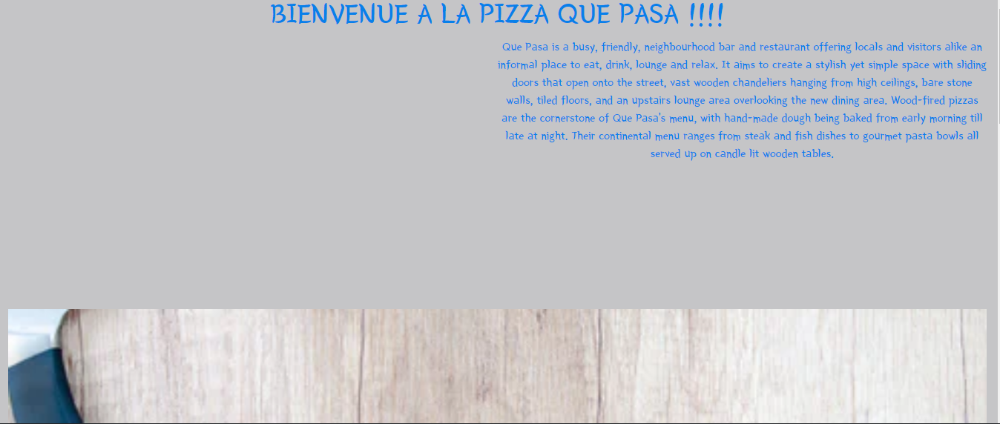
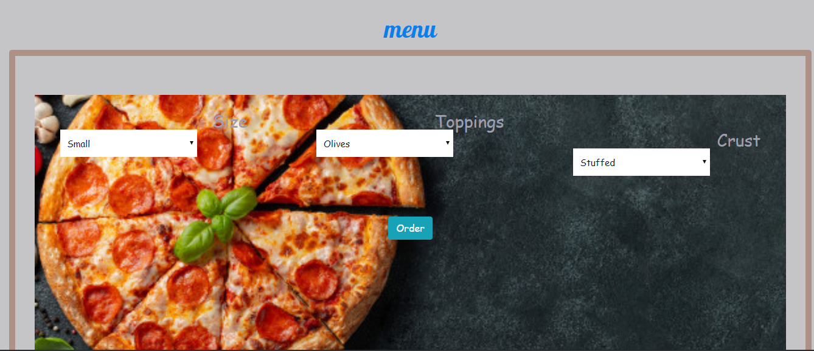

# Delani Studio site
## Ian charawe
## Description
pizza project is a design website that aids the user to input an order online and make purchase for a pizza
## Deployment
https://github.com/Nyiva/PizzaFest
## Technology used
-HTML
-CSS
-Bootstrap 4.3.1
-Jquery 3.4.1
-Javascript
-popper.js
## BDD

- project is about pizza website and has one page
- About us explains the function of the website
- the menu shows the functions given fot the user to manipulate
- What we do is a section that allow users to toggle through the functions
- when it comes to the email the website is responsive and gives a feedback depending on the entry

## BUGS
it contains bugs in css and html
## Support and contact details
Iancharawe94@gmail.com
254 27 487 476
## License
MIT license